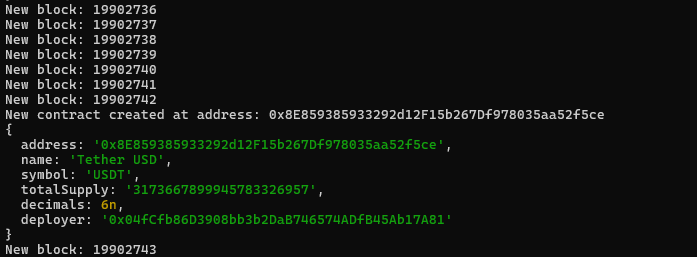
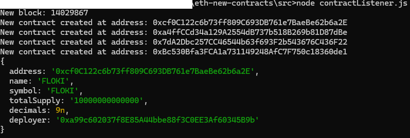

# Ethereum Contract Creation Listener

This TypeScript library leverages ethers.js v6 to monitor new blocks on the Ethereum blockchain and identify new smart contract creations, specifically targeting ERC-20 token contracts. It provides some basic information about each detected contract, such as the contract's name, symbol, and total supply, adjusted for decimals.
This code is meant for developers starting out on web3 development for ethereum and looking for a way to efficiently stream new contract creations.

## Features

- Real-time monitoring of Ethereum blocks.
- Detection of new smart contract deployments.
- Verification if the deployed contracts are ERC-20 tokens.
- Retrieval of ERC-20 token metadata (name, symbol, total supply, decimals).

## Prerequisites

Ensure you have Node.js installed on your machine. This library is built using ethers.js v6, so you must have ethers installed:

```bash
npm install ethers@6.x
```

## Installation

First, clone the repository and install the required dependencies:

```bash
git clone https://github.com/bilix-software/eth-new-contracts
cd eth-new-contracts
npm install
```

## Usage

The main functionality is contained within the `src/contractlistener.ts` file. You can run the listener in two ways:

### 1. Start Listening Continuously

To continuously monitor for new contracts, simply start the listener with the following command:

```bash
ts-node src/contractlistener.ts
```

This will activate the listener, which will log all new contract creations and relevant ERC-20 token information to the console.



### 2. Check Specific Block

If you want to check for contract creations in a specific block, you can modify the last lines of the `contractlistener.ts` script to call `checkBlock` with the desired block number:

```typescript
const listener = new ContractCreationListener('<your-provider-url>');
listener.checkBlock(<block-number>);
```

Then, run the script:

```bash
ts-node src/contractlistener.ts
```



## Configuration

You need to set the Ethereum node provider URL directly in the `contractlistener.ts` file or via environment variables. By default, it is configured to:

```typescript
const listener = new ContractCreationListener('https://eth.llamarpc.com');
```

You can change this to any other Ethereum JSON RPC provider.

## Contributions

Contributions are welcome! Please submit any bugs or feature requests through the issue tracker associated with the repository.

## License

This project is licensed under the MIT License - see the [LICENSE.md](LICENSE.md) file for details.
```

Modify the sections as needed to better fit your actual setup and repository structure. If you have additional configuration or setup steps, those should be included in the respective sections.